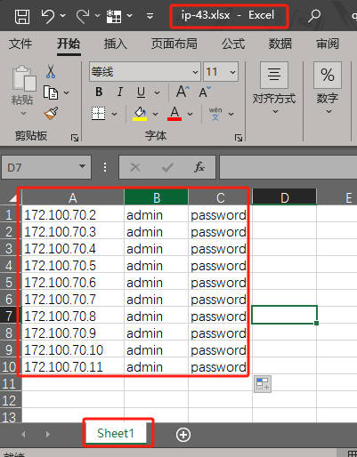

## Conda 是一个流行的包管理和环境管理工具，特别是在 Python 开发中非常实用。以下是一些常用的 Conda 命令：

### 环境管理：

```sh
指定 Python 版本创建环境：conda create --name ipmitool-test python=3.10
激活环境：conda activate ipmitool-test
退出环境：conda deactivate
```

### 包管理：

```sh
安装包：
pip install openpyxl
pip install subprocess

安装指定版本的包：conda install package_name=1.0
卸载包：conda remove package_name
更新包：conda update package_name
搜索可用包：conda search search_term
查看已安装的包：conda list
```

### 环境导出与导入：

```sh
导出环境：conda env export > environment.yaml
从环境文件创建环境：conda env create -f environment.yaml
```
## 主机ip地址、初始账户、初始密码等数据

### 数据要求以及数据格式示例




## 程序使用示例

```sh
#虚拟化环境配置完成后直接执行
python main-subprocess.py


#后台执行并输出日志到add_bmc_user_py.log
nohup python main-subprocess.py > add_bmc_user_py.log 2>&1 &

```


